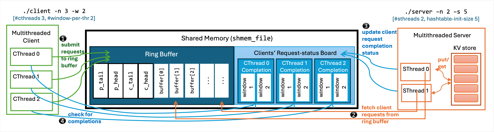
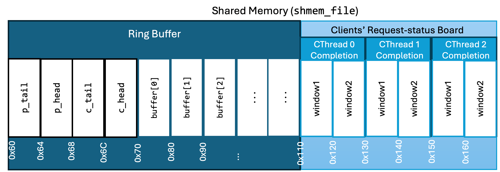

# Administrivia

- **Due date**: April 16th, 2024 at 11:59pm.

- Projects may be turned in up to 3 days late but you will receive a penalty of
10 percentage points for every day it is turned in late.
- **Slip Days**: 
  - In case you need extra time on projects, you each will have 2 slip days for individual projects and 3 slip days for group projects (5 total slip days for the semester). After the due date we will make a copy of the handin directory for on time grading. 
  - To use slip days or turn in your assignment late you will submit your files with an additional file that contains only a single digit number, which is the number of days late your assignment is (e.g 1, 2, 3). Each consecutive day we will make a copy of any directories which contain one of these slipdays.txt files. This file must be present when you submit you final submission, or we won't know to grade your code. 
  - We will track your slip days and late submissions from project to project and begin to deduct percentages after you have used up your slip days.
  - After using up your slip days you can get up to 90% if turned in 1 day late, 80% for 2 days late, and 70% for 3 days late, but for any single assignment we won't accept submissions after the third day without an exception. This means if you use both of your individual slip days on a single assignment you can only submit that assignment one additional day late for a total of 3 days late with a 10% deduction.
  - Any exception will need to be requested from the instructors.

  - Example slipdays.txt
```~~~~
1
```
- Tests will be provided in ```~cs537-1/tests/P6```. There is a ```README.md``` file in that directory which contains the instructions to run
the tests. The tests are partially complete and your project may be graded on additional tests.
- Questions: We will be using Piazza for all questions.
- Collaboration: The assignment may be done by yourself or with one partner. Copying code from anyone else is considered cheating. [Read this](http://pages.cs.wisc.edu/~remzi/Classes/537/Spring2018/dontcheat.html) for more info on what is OK and what is not.  Please help us all have a good semester by not doing this.
- This project is to be done on the [Linux lab machines
](https://csl.cs.wisc.edu/docs/csl/2012-08-16-instructional-facilities/),
so you can learn more about programming in C on a typical UNIX-based
platform (Linux).  Your solution will be tested on these machines.
- If applicable, a **document describing online resources used** called **resources.txt** should be included in your submission. You are welcome to use resources online to help you with your assignment. **We don't recommend you use Large-Language Models such as ChatGPT.** For this course in particular we have seen these tools give close, but not quite right examples or explanations, that leave students more confused if they don't already know what the right answer is. Be aware that when you seek help from the instructional staff, we will not assist with working with these LLMs and we will expect you to be able to walk the instructional staff member through your code and logic. Online resources (e.g. stack overflow) and generative tools are transforming many industries including computer science and education.  However, if you use online sources, you are required to turn in a document describing your uses of these sources. Indicate in this document what percentage of your solution was done strictly by you and what was done utilizing these tools. Be specific, indicating sources used and how you interacted with those sources. Not giving credit to outside sources is a form of plagiarism. It can be good practice to make comments of sources in your code where that source was used. You will not be penalized for using LLMs or reading posts, but you should not create posts in online forums about the projects in the course. The majority of your code should also be written from your own efforts and you should be able to explain all the code you submit.

- **Handing it in**:
  - Copy the files `common.h`, `client.c`, `ring_buffer.h`, `ring_buffer.c`, `kv_store.c` and `Makefile` (also `kv_store.h` if you used it). Your code should compile correctly and run. 
  - **Group project handin:** each group only needs to hand in once. To submit,
    one person should put the code in their handin directory (the other should
    be empty).

# Key-Value Server

In this project, you're going to implement a concurrent **Key-Value (KV) Store** as a server in a client-server model. There are **one** server process and **one** client process; both are multithreaded processes. They use a shared memory region for interprocess communication. You need to implement a concurrent **Ring Buffer** and a shared **Request-status Board** in the shared memory for processing requests.

# Objectives

- To implement a thread-safe concurrent KV Store
- To implement a thread-safe Ring Buffer
- To understand interprocess communication through shared memory region  
- To understand and optimize synchronizing mechanisms for performance

# Project Details



The above figure illustrates the client-server model for this project.
Both the server and the client are multithreaded processes. They communicate through a file-backed shared mmap, which is divided into two regions: a Ring Buffer and a Request-status Board. 
- **Client:** 
  The client submits PUT/GET requests to the server through the Ring Buffer.
- **Server:** 
  The server contains a KV Store, which it uses to serve those requests. It reads client requests from the Ring Buffer, processes them; and upon completing a request, updates its completion status along with the response in a *pre-specified* window of the Request-status Board. Therefore, the client can read a *specific* window to check the completion status and response of a particular request. 

In this example, the client has three threads, and the server has two. There are two windows per client thread in the Request-status Board. The initial hash table size for the KV Store is set to 5. 

The server is executed using the following command:
```bash
./server -n 2 -s 5
```
Here, `-n` is the number of threads, and `-s` is the initial hashtable size for the KV Store.

The client is executed using the following command:
```bash
./client -n 3 -w 2
```
Here, `-n` is the number of threads and `-w` is the number of windows per client in the Request-status Board.

You need to implement the Key Value server and also the Ring Buffer. 
We provide you the definition of the Ring Buffer (`ring_buffer.h`). 
We also provide the client code (`client.c`). However, you need to make the shared region thread-safe. 

## Ring Buffer

A ring buffer, also known as a circular buffer, is a data structure that uses a single, fixed-size buffer as if it were connected end-to-end. 
This Ring Buffer is similar to a shared buffer in a producer-consumer model. It facilitates communication between the client and the server by allowing client to submit requests concurrently (producer), which the server consumes for processing (consumer). 
The Ring Buffer looks like the following:
```c
struct ring { // defined inside ring_buffer.h
	// ..
	struct buffer_descriptor buffer[RING_SIZE]; // this is the ring
};
int init_ring();
void ring_submit(struct ring *r, struct buffer_descriptor *bd); 
void ring_get(struct ring *r, struct buffer_descriptor *bd); 
```
Here, `init_ring()` initializes the Ring Buffer. 
The client submits new requests to the buffer through `ring_submit()`.  
The server fetches requests from the buffer using `ring_get()`.


A client request looks like the following: 
```c
struct buffer_descriptor { // defined inside ring_buffer.h
    enum REQUEST_TYPE req_type; // PUT/GET
    key_type k;     // key
    value_type v;   // value
    int res_off;    // result offset in bytes
    int ready;      // completion status flag
};
```
The request is of type `PUT` or `GET`. If it is a `PUT` request, the key and value is provided. If it is a `GET` request, only the key is provided. 
When submitting the request, the `ready` flag is set to `0`.
The result offset stores the location offset where the client will look for the status of this request. The [Request-status Board](#request-status-board) contains more details.
Since multiple server threads and multiple client threads can access the Ring Buffer concurrently, you need to make it thread-safe.

## Request-status Board 

The Request-status Board follows the Ring Buffer in the shared memory region.
It consists of windows, each containing the completion status and the response of a request. 
The board is equally divided among client threads. That means, each client thread owns a fixed number of consecutive windows (`w`, specified as a command line argument in client) in the board. Codewise, each window is also of the type `struct buffer_descriptor` (same as each client request).

The client associates each request with a window in the board using result offset (`res_off`). The result offset stores in which (byte) offset the associated window is,  starting from the start of the shared memory. After the server processes a request, it stores the response of the request in that offset, and then sets the `ready` flag to `1`. The client can check a window to determine whether a particular request is complete and to retrieve the response. 
Naturally, a client thread cannot submit more than `w` requests at a time, since it needs to specify a particular window through `res_off` in the request. 

<!--  -->


For example, suppose in the above figure, the shared memory region starts at address `0x60`. The Ring Buffer ends and the Request-status Board starts at address `0x110`. Then, the first request of client thread 1 will contain `res_off = 208` (`0x130-0x60 = 208`).

## KV Store

The server's KV Store should be implemented as a hashtable using the following hash function (defined in `common.h`): 
```
h(key) = key % table-size
```
The initial hashtable size (`s`) is provided as a command line argument for the server. 
However, you are free to choose the type of hashtable (e.g., open-addressing, chaining, etc.). 

Since multiple threads will use the KV Store to serve clients' requests, you need to make it thread-safe.
There are two ways to implement thread-safe versions of the KV Store:
- **Coarse-grained locking**
  - It uses a single lock to protect the whole KV Store, which means you are enforcing sequential access to the KV Store, even though different threads may work on different parts of the KV Store. 
- **Fine-grained locking**
  - It uses finer granularity locks to protect the KV Store, allowing for more concurrent access. That means you should have different locks for different parts of the KV Store. This will allow multiple threads to work safely on the KV Store simultaneously. *You have to implement this for your project.* **We expect your implementation to be faster than Coarse-grained locking.** Therefore, you should wisely choose an appropriate level of granularity for the locks. More and finer locks mean more threads can access the KV Store concurrently; however, that also means more memory and lock management overhead. 


## Starter Code and Implementation Details


### The following four files are provided:

- `common.h` contains type definitions and the hash function. You **MUST NOT** change this file.

- **`ring_buffer.h`** defines the structure and operations of the Ring Buffer, which you should implement inside `ring_buffer.c`. You are free to add/remove fields to `struct ring`, but do not change the interface functions. However, you can **ONLY ADD** new fields to `struct buffer_descriptor`, if necessary. Do **NOT** remove current elements.

- **`client.c`** implements the multi-threaded client application. It initializes the filebacked shared memory. The shared file name is **`shmem_file`**, which is fixed for this project. It initializes the Ring Buffer, submits requests to the Ring Buffer for processing, and checks for the completions of requests. Note that this file uses your implementation of the Ring Buffer. **Do NOT change this file** since we will replace this. This process can fork the server program as a child process. Execute this with `./client -h` to know more about its command line arguments.

- `Makefile` builds the client and the server. 

### You have to implement the following two files:

- **`ring_buffer.c`**: 
    Here you should implement the three function prototypes inside `ring_buffer.h`. 
    - `init_ring()`: This funciton initializes the Ring Buffer.
    - `ring_submit(*r, *bd)`: This function submits a new item to the Ring Buffer. It should be thread-safe and will block if there's not enough space.
    - `ring_get(*r, *bd)`:  This function retrieves an item from the Ring Buffer. It should be thread-safe and will block if the buffer is empty.

- **`kv_store.c`**: 
    Here you should implement the KV Store and the server application. It should have the following features:
    - `put(key_type k, value_type v)`: This function is used to insert a key-value pair into the store. If the key already exists, it updates the associated value.
    - `get(key_type k)`: This function is used to retrieve the value associated with a given key from the store. If the key is not found, it returns `0`.
    - The server should be able to fetch requests from the Ring Buffer, and update the Request-status Board after completing the requests. **We expect the server to be faster with an increase in the number of threads.**
    - Also implements the server `main()` function with the following command line arguments: 
      - `-n`: number of server threads
      - `-s`: the initial hashtable size
  

## Best Practices

- Consider using atomic operations for updating the head and tail indices in the Ring Buffer to ensure thread safety without locking. You can also use them in the KV Store. Atomic operations are generally faster than mutexes or semaphores because they do not involve the overhead of context switches or kernel intervention, which is common with locking mechanisms. They are hardware-level operations that can be executed without locking the entire data structure. You might get inspired from [DPDK Ring Buffer](https://doc.dpdk.org/guides/prog_guide/ring_lib.html). Using atomic operations is **optional** for this project. 

